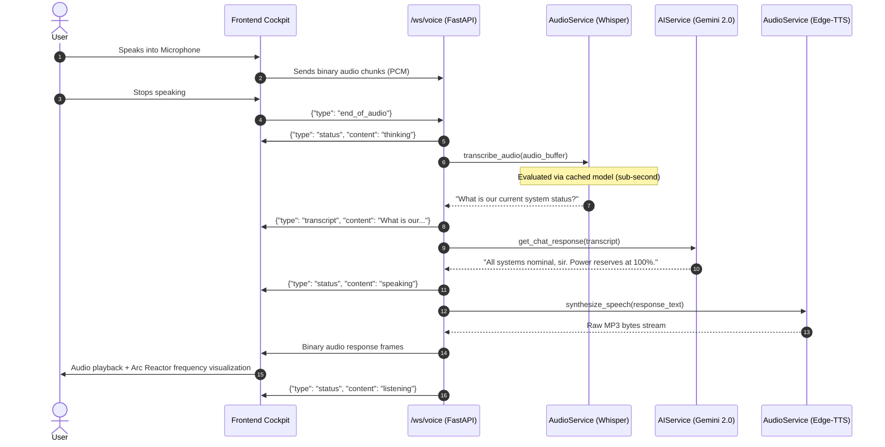

# J.A.R.V.I.S. — Realtime AI Assistant System Architecture

## 1. System Overview
J.A.R.V.I.S. is an ultra-responsive, full-stack voice assistant and cybernetic cockpit. Users can interact via natural voice conversation, streaming text chat, and a dynamic HTML5 Canvas HUD. The system features a zero-marginal-cost pipeline leveraging Google's **Gemini 2.0 Flash**, Microsoft **Edge-TTS**, and a singleton-cached **Whisper** Speech-To-Text model.

---

## 2. Core Tech Stack
- **Frontend:** React 18 + Vite + TypeScript + HTML5 Canvas API + Web Audio Analyser
- **Backend:** Python 3.11 + FastAPI + WebSockets + Uvicorn
- **AI Intelligence:** Google GenAI SDK (`gemini-2.0-flash`) with J.A.R.V.I.S. persona
- **Speech-To-Text (STT):** OpenAI Whisper (local execution with singleton in-memory caching)
- **Text-To-Speech (TTS):** Microsoft Edge-TTS neural audio synthesis (`en-US-JennyNeural`)
- **Containerization:** Docker + Multi-stage Nginx Reverse Proxy + Docker Compose

---

## 3. High-Level Architecture Flow

```
┌────────────────────────────────────────────────────────────────────────┐
│                         FRONTEND (React + Canvas)                      │
│                                                                        │
│  [Microphone / Web Audio] ────┐          ┌─── [Arc Reactor HUD]        │
│                               │          │     (Live audio pulses)     │
│                               ▼          ▼                             │
│                  WebSocket Client (ArrayBuffer / JSON)                 │
└───────────────────────────────────┬────────────────────────────────────┘
                                    │
                         WS /ws/voice & /ws/chat
                                    │
┌───────────────────────────────────▼────────────────────────────────────┐
│                         BACKEND (FastAPI Core)                         │
│                                                                        │
│  ┌───────────────────────┐ ┌───────────────────────┐ ┌──────────────┐ │
│  │     voice_ws.py       │ │      chat_ws.py       │ │  FastAPI REST│ │
│  │ (Full-duplex audio)   │ │  (Token streaming)    │ │ (/api/chat)  │ │
│  └───────────┬───────────┘ └───────────┬───────────┘ └──────┬───────┘ │
│              │                         │                    │         │
│              ▼                         ▼                    ▼         │
│     ┌─────────────────┐       ┌─────────────────┐ ┌─────────────────┐ │
│     │  AudioService   │       │    AIService    │ │  AudioService   │ │
│     │ (Whisper STT)   │       │(Gemini 2.0 Flash│ │(Edge-TTS Synth) │ │
│     └─────────────────┘       └─────────────────┘ └─────────────────┘ │
└────────────────────────────────────────────────────────────────────────┘
```

---

## 4. Voice Pipeline Dataflow Sequence



---

## 5. Key Design Optimizations

### 5.1 Singleton Whisper STT Caching
- **The Problem:** In naive implementations, calling `whisper.load_model("base")` inside the WebSocket loop causes multi-hundred megabyte disk I/O and weight allocation on *every voice turn*, adding 1.5–3.5s latency.
- **The Solution:** `AudioService` caches the model instance upon initial load as a thread-safe singleton in RAM. Subsequent transcription requests execute instantly in sub-second time.

### 5.2 Zero-Cost Neural Voice Synthesis
- **The Problem:** Commercial cloud voice APIs (e.g. OpenAI TTS, ElevenLabs) charge $0.015 to $0.30 per minute, rendering long realtime sessions expensive.
- **The Solution:** Integrated Microsoft Edge-TTS streaming protocol (`edge-tts`), delivering near-instant human-quality neural voice output (`en-US-JennyNeural`) with zero external subscription costs.

### 5.3 Resilient Standalone Hybrid Fallback
- **Browser-Side Brain:** If the FastAPI backend is offline, the frontend gracefully falls back to browser-native Web Speech API synthesis + client-side Wikipedia factual knowledge extraction, ensuring uninterrupted interactive HUD operation.
